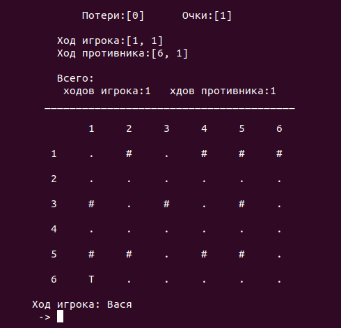
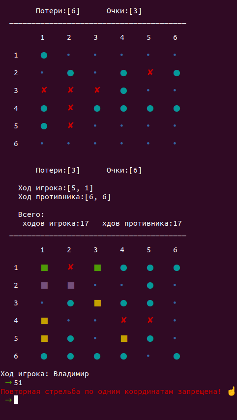

# B7.5
Консольная версия игры "Морской бой"

> Первый ход предоставляется игроку (человеку).
Ход осуществляется путем ввода координат соответствующих строке и столбцу, например 12 - 1-я строка 2-й столбец.

> Нельзя сделать выстрел по координатам, по которым игрок уже стрелял.

> После человека выстрел делает компьютер.

> При вводе некорректных значений появляется предупреждение.

> Побеждает игрок первый разбивший флот противника.

> q - прервать игру.