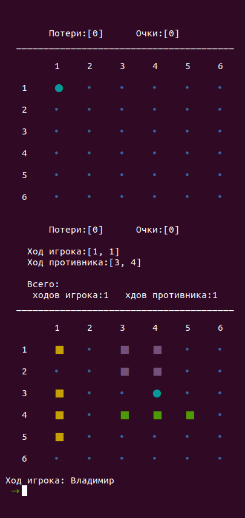
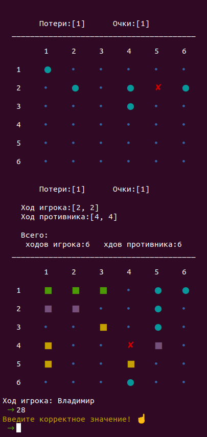
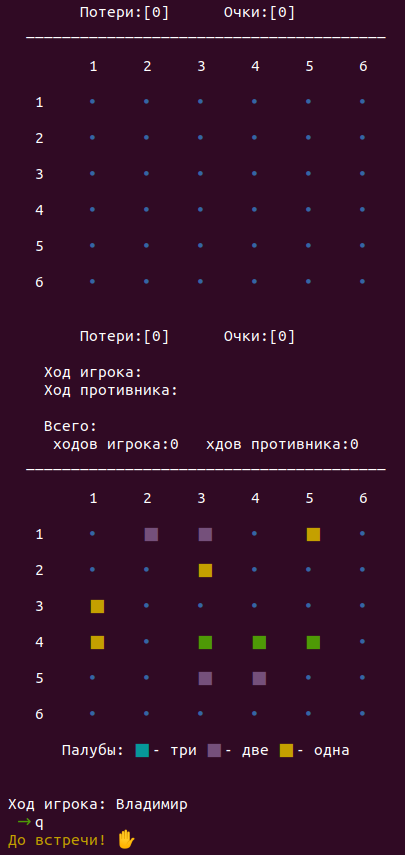

# B7.5
Консольная версия игры "Морской бой"

> Первый ход предоставляется игроку (человеку).
Ход осуществляется путем ввода координат соответствующих строке и столбцу, например 12 - 1-я строка 2-й столбец.

> При некорректном вводе выводится предупреждение.

> Нельзя сделать выстрел по координатам, по которым игрок уже стрелял.

> q - прервать игру.

> Побеждает игрок первый разбивший флот противника.

